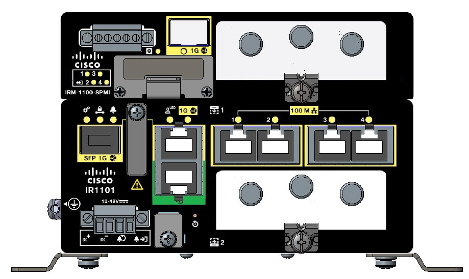
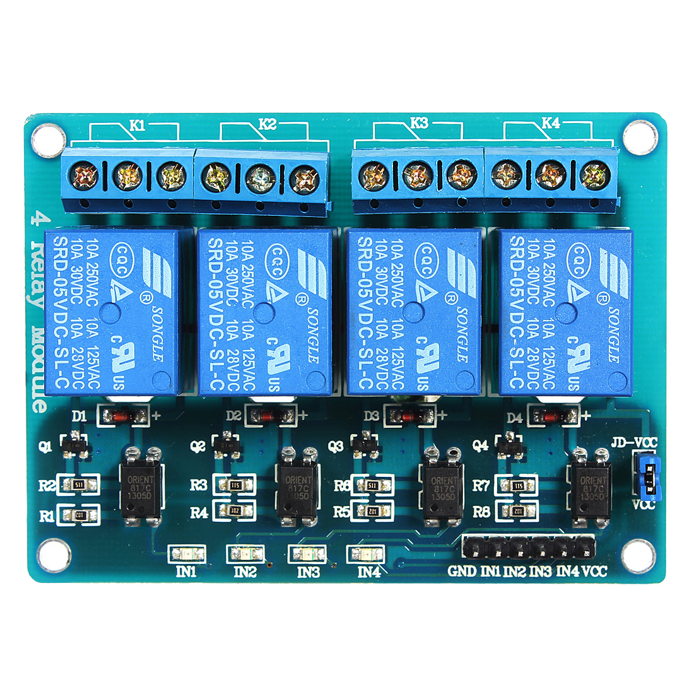

# iox-ir1101-dio-modbus

## Purpose

Cisco IOx application to expose Cisco IR1101 Digital I/O ports as a read/write Modbus/TCP device using Python and [pyModbus](https://github.com/riptideio/pymodbus).

When running, the 4 Digital I/O ports can be controlled (read and write) using any standard Modbus/TCP application running on the platform (such as [Cisco Edge Intelligence](https://www.cisco.com/c/en/us/solutions/internet-of-things/edge-intelligence.html)) or outside the platform, such as a computer.

## Introduction

[Cisco's Industrial Router IR1101](https://www.cisco.com/c/en/us/products/routers/1100-series-industrial-integrated-services-routers/index.html) is a modular and rugged platform for industrial applications and includes [Cisco IOx](https://developer.cisco.com/docs/iox/) - a framework to run containers on the router.

When the IR1101 is mounted with the optional SPMI exansion module, shown below, the platform also adds 4 General Purpose Input/Output (GPIO) ports also called Digital I/O Connections.



These ports are digital ports and only know a boolean state, and can be used in a variety of applications:

* as OUTPUT to trigger an external device: fan, generator, light and so on.
* as INPUT to receive external events such as fluid level sensor, door contact, and others.

## Wiring the ports

The GPIO connector is composed of five contacts as shown below. The #5 is the common, it can be used to apply for instance +5V power to control 4 relay coils that are connected to outputs #1 to #4.

Those ports are transistor-driven and therefore large loads cannot be controlled directly. Please make sure to check the [acceptable voltage and current input and output maximums in the documentation](https://www.cisco.com/c/en/us/td/docs/routers/access/1101/b_IR1101HIG/b_IR1101HIG_chapter_01.html) or you will damage the equipment.


For example if you are using a relay module such as this one shown below, here is how to do the connections:

| IR1101 Port# | Purpose            | Relay Board  | Power Supply |
|--------------|--------------------|--------------|--------------|
| 1            | Digital I/O port 1 | IN1 |        |              |
| 2            | Digital I/O port 2 | IN2 |        |              |
| 3            | Digital I/O port 3 | IN3 |        |              |
| 4            | Digital I/O port 4 | IN4 |        |              |
| 5            | Common (high)      | VCC | +5V DC |              |
|              | 0V                 | GND | GND    |              |



## Building the project

You need to make sure to [meet all the prerequities](https://github.com/etychon/iox-ir1101-dio-read) to build this app (have Docker, ioxclient, etc...) and also have IOx enabled on your platform. Check [this other project](https://github.com/etychon/iox-ir1101-dio-read) as we are not going to repeat it all here.

Clone the repository:

```
$ git clone https://github.com/etychon/iox-ir1101-dio-modbus.git
```

Enter the directory and build the application:

```
$ cd iox-ir1101-dio-modbus/
$ sh ./build.sh
```

Follow [this other project](https://github.com/etychon/iox-ir1101-dio-read) instructions to deploy, activate and start the IOx application.

## Exposing Modbus TCP port number

The IOx application will with an IP address in the same range as `VirtualPortGroup0`. It could be assigned via DHCP is you have configured a DHCP server, or statically. Either way you may want to expose that application Modbus TCP port number (which is 5020) to the outside word using static NAT mapping.

Assuming your IOx application is running as `192.168.1.8` add the following NAT rule to Cisco IR1101 IOS configuration:

```
interface GigabitEthernet0/0/0
  ip nat outside
interface VirtualPortGroup0
 ip nat inside
ip nat inside source static tcp 192.168.1.8 5020 interface GigabitEthernet0/0/0 5020
```

## Testing

As an illustration I have included two client applications to this repo that can be used from a computer.

* `client.py` will query continuously the 4 Digital I/O ports and give the status (True or False). This is a read-only operation.
* `client_wr.py` will write random states for all 4 ports continuously.

For each script, the Modbus/TCP server IP address to be used needs to be changed at the begining of the script by editing the line below and replace the IP address by the public IP address and port of the IOx application:

```
client = ModbusTcpClient("192.168.2.101", port=5020)
```

Note that this program will handle simultaneous Modbus/TCP connections so you can use both scripts at the same time.
