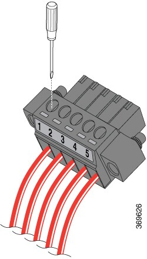

# iox-ir1101-dio-modbus

## Purpose

Cisco IOx application to expose Cisco IR1101 Digital I/O ports as a read/write Modbus/TCP device using Python and [pyModbus](https://github.com/riptideio/pymodbus).

When running, the 4 Digital I/O ports can be controlled (read and write) using any standard Modbus/TCP application running on the platform (such as [Cisco Edge Intelligence](https://www.cisco.com/c/en/us/solutions/internet-of-things/edge-intelligence.html)) or outside the platform, such as a computer.

## Introduction

[Cisco's Industrial Router IR1101](https://www.cisco.com/c/en/us/products/routers/1100-series-industrial-integrated-services-routers/index.html) is a modular and rugged platform for industrial applications and includes [Cisco IOx](https://developer.cisco.com/docs/iox/) - a framework to run containers on the router.

When the IR1101 is mounted with the optional SPMI exansion module, shown below, the platform also adds 4 General Purpose Input/Output (GPIO) ports also called Digital I/O Connections.

These ports are digital ports and only know a boolean state, and can be used in a variety of applications:

* as OUTPUT to trigger an external device: fan, generator, light and so on.
* as INPUT to receive external events such as fluid level sensor, door contact, and others.

## Wiring the ports

The GPIO connector has 5 wires as shown below. The #5 is the common, it can be used to apply for instance +5V power to control 4 relay coils that are connected to outputs #1 to #4.

Those ports are transistor-driven and therefore large loads cannot be controlled directly. Please make sure to check the [acceptable voltage and current input and output maximums in the documentation](https://www.cisco.com/c/en/us/td/docs/routers/access/1101/b_IR1101HIG/b_IR1101HIG_chapter_01.html) or you will damage the equipment.

For example if you are using a relay module such as this one shown below, here is how to do the connections:

| IR1101 Port# | Purpose            | Relay Board  | Power Supply |
|--------------|--------------------|--------------|--------------|
| 1            | Digital I/O port 1 | IN1 |        |              |
| 2            | Digital I/O port 2 | IN2 |        |              |
| 3            | Digital I/O port 3 | IN3 |        |              |
| 4            | Digital I/O port 4 | IN4 |        |              |
| 5            | Common (high)      | VCC | +5V DC |              |
|              | 0V                 | GND | GND    |              |

